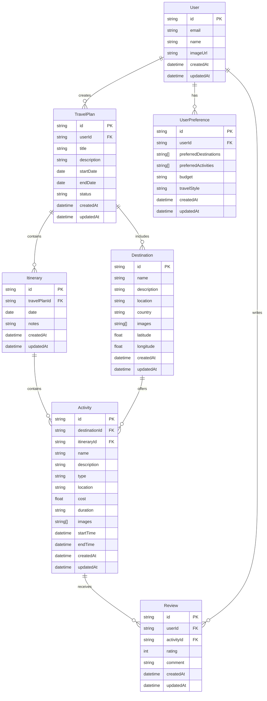

# AI Travel Planner - Database Design

## Database Overview

The AI Travel Planner uses PostgreSQL as its primary database, managed through Prisma ORM. The database is designed to handle user data, travel plans, preferences, and various related entities while maintaining data integrity and relationships.

## Entity Relationship Diagram (ERD)

## Schema Details

### User

- Primary entity for user management
- Stores basic user information
- Links to Clerk authentication
- One-to-many relationship with TravelPlans and Reviews

### UserPreference

- Stores user preferences for travel planning
- Includes preferred destinations, activities, budget, and travel style
- One-to-one relationship with User

### TravelPlan

- Core entity for travel planning
- Contains trip details including dates and status
- Links to multiple destinations and itineraries
- One-to-many relationship with Itinerary

### Destination

- Stores information about travel destinations
- Includes location data and images
- Many-to-many relationship with TravelPlan
- One-to-many relationship with Activity

### Itinerary

- Daily schedule within a travel plan
- Contains activities for specific dates
- One-to-many relationship with Activity

### Activity

- Represents specific activities or attractions
- Includes detailed information about the activity
- Links to destinations and itineraries
- One-to-many relationship with Review

### Review

- Stores user reviews for activities
- Includes ratings and comments
- Links to both User and Activity

## Database Indexes

### Primary Indexes

- All tables have primary key indexes on `id` fields
- Foreign key indexes for relationship fields

### Secondary Indexes

- User: `email` (unique)
- TravelPlan: `userId`, `status`
- Activity: `destinationId`, `itineraryId`
- Review: `userId`, `activityId`

## Data Types and Constraints

### Common Fields

- `id`: String (CUID2)
- `createdAt`: DateTime
- `updatedAt`: DateTime

### Specific Constraints

- Email addresses must be unique
- Dates must be valid and logical (end date after start date)
- Ratings must be between 1 and 5
- Required fields are marked as non-nullable

## Data Validation

- Input validation using Zod schemas
- Prisma schema validation
- Database-level constraints
- Type safety through TypeScript

## Data Relationships

### One-to-One

- User ↔ UserPreference

### One-to-Many

- User → TravelPlan
- User → Review
- TravelPlan → Itinerary
- Destination → Activity
- Itinerary → Activity
- Activity → Review

### Many-to-Many

- TravelPlan ↔ Destination

## Data Security

- Row-level security where applicable
- Encrypted sensitive data
- Audit trails for important changes
- Access control through Prisma middleware

## Performance Considerations

- Efficient indexing strategy
- Optimized query patterns
- Caching frequently accessed data
- Pagination for large result sets

## Backup and Recovery

- Regular automated backups
- Point-in-time recovery capability
- Data retention policies
- Disaster recovery procedures
