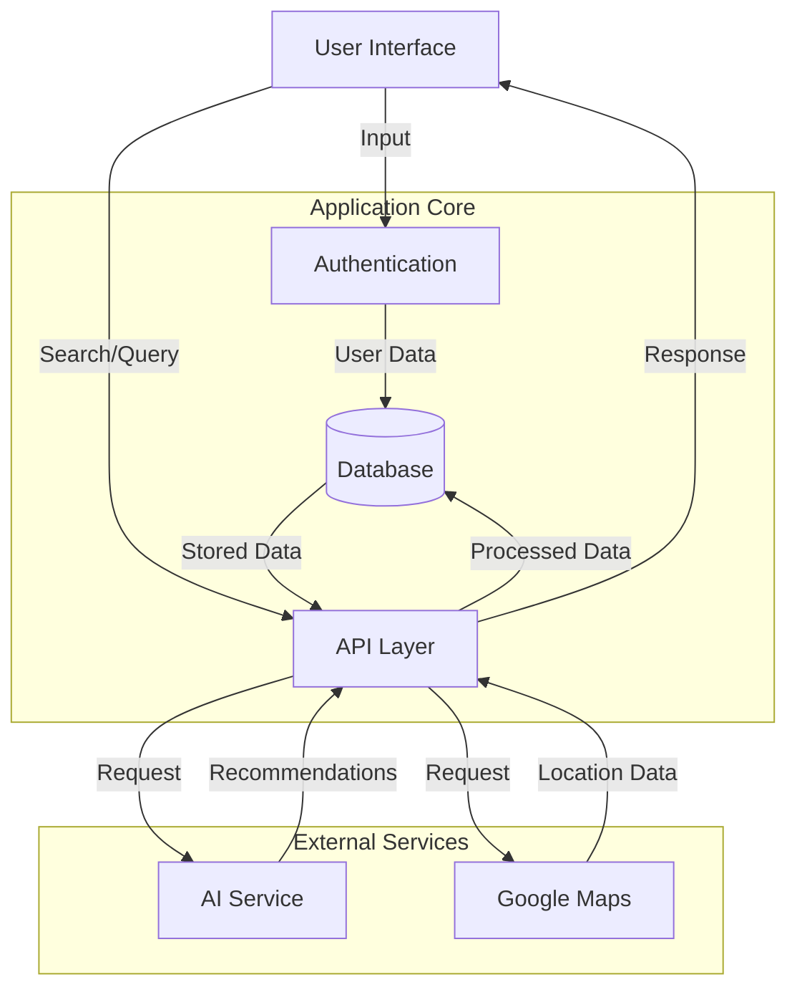
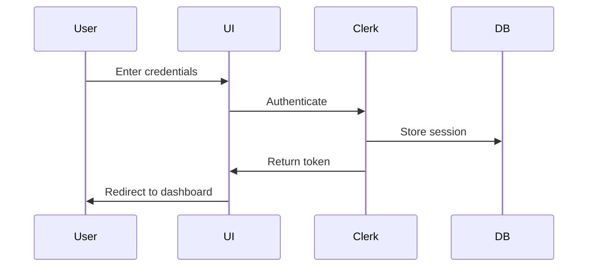
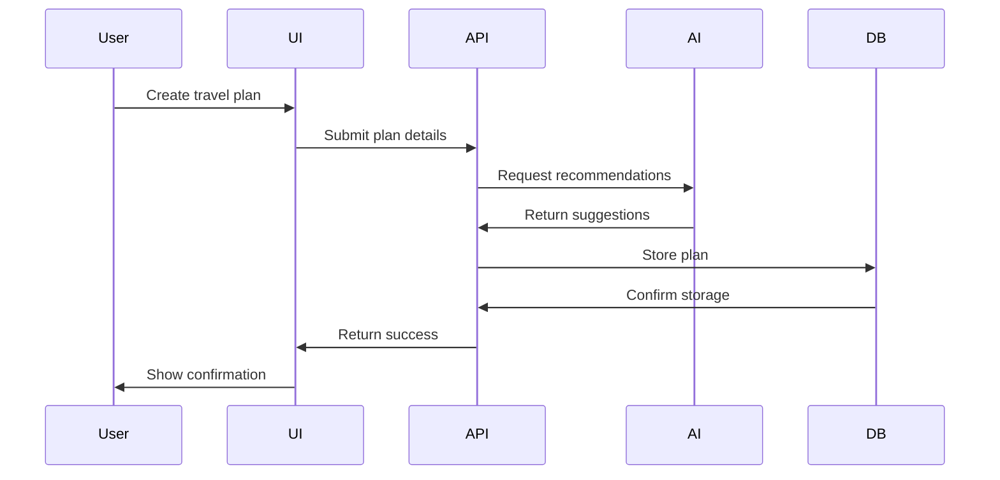
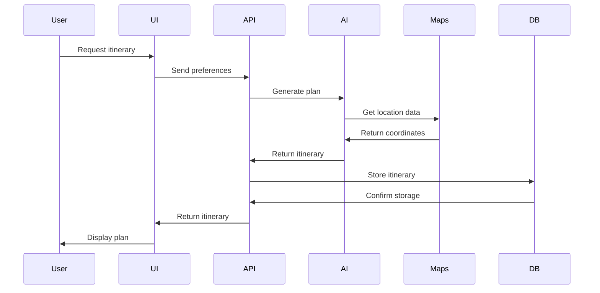

# AI Travel Planner - Data Flow Documentation

## Overview

This document outlines the data flow patterns within the AI Travel Planner application, from user input to data persistence and retrieval.

## High-Level Data Flow Diagram

## Data Flow Patterns

### 1. User Authentication Flow

### 2. Travel Plan Creation Flow

### 3. Itinerary Generation Flow

## Data Transformation Points

### 1. User Input Processing

- Form validation using Zod
- Data sanitization
- Type conversion
- Error handling

### 2. AI Service Integration

- Natural language processing
- Preference analysis
- Recommendation generation
- Response formatting

### 3. Location Data Processing

- Geocoding
- Distance calculations
- Route optimization
- Place details enrichment

### 4. Database Operations

- Data validation
- Relationship management
- Transaction handling
- Cache management

## Data Storage Patterns

### 1. User Data

- Profile information
- Preferences
- Authentication tokens
- Session data

### 2. Travel Plans

- Plan details
- Itineraries
- Activities
- Reviews

### 3. Location Data

- Destinations
- Points of interest
- Maps data
- Route information

## Data Security Measures

### 1. Authentication

- JWT token management
- Session handling
- Role-based access control

### 2. Data Protection

- Input validation
- SQL injection prevention
- XSS protection
- CSRF protection

### 3. API Security

- Rate limiting
- Request validation
- Error handling
- Logging

## Performance Considerations

### 1. Caching Strategy

- Client-side caching
- Server-side caching
- Database query caching
- API response caching

### 2. Data Optimization

- Pagination
- Lazy loading
- Data compression
- Query optimization

### 3. Real-time Updates

- WebSocket connections
- Push notifications
- State management
- Data synchronization

## Error Handling

### 1. Client-side Errors

- Form validation errors
- API request failures
- Network issues
- UI state errors

### 2. Server-side Errors

- Database errors
- External service failures
- Authentication errors
- Rate limiting

### 3. Recovery Procedures

- Automatic retries
- Fallback mechanisms
- Error reporting
- User notifications
