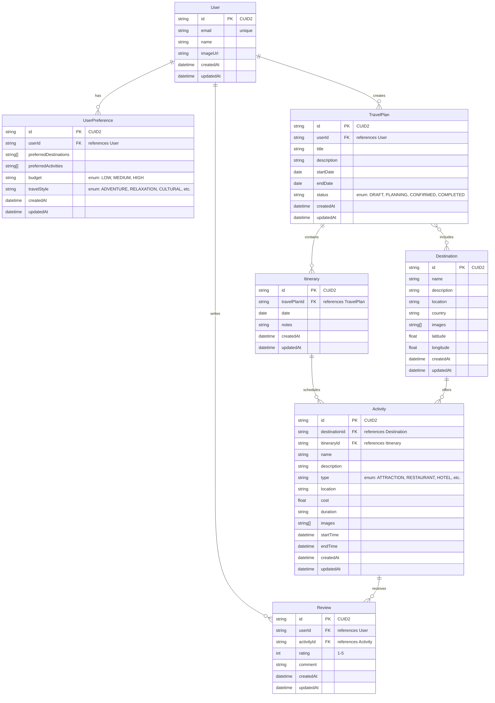

# AI Travel Planner - Entity Relationship Diagram (ERD)

## Overview

The Entity Relationship Diagram (ERD) below represents the complete database structure of the AI Travel Planner application. It shows all entities, their attributes, and the relationships between them.

## Complete ERD

## Relationship Explanations

### One-to-One Relationships

1. **User ↔ UserPreference**
   - Each user has exactly one set of preferences
   - Each preference belongs to exactly one user

### One-to-Many Relationships

1. **User → TravelPlan**

   - A user can create multiple travel plans
   - Each travel plan belongs to one user

2. **User → Review**

   - A user can write multiple reviews
   - Each review is written by one user

3. **TravelPlan → Itinerary**

   - A travel plan can have multiple daily itineraries
   - Each itinerary belongs to one travel plan

4. **Destination → Activity**

   - A destination can have multiple activities
   - Each activity is associated with one destination

5. **Itinerary → Activity**

   - An itinerary can contain multiple activities
   - Each activity can be part of one itinerary

6. **Activity → Review**
   - An activity can have multiple reviews
   - Each review is for one activity

### Many-to-Many Relationships

1. **TravelPlan ↔ Destination**
   - A travel plan can include multiple destinations
   - A destination can be part of multiple travel plans

## Key Features of the ERD

### Primary Keys

- All entities use CUID2 as their primary key
- Ensures globally unique identifiers
- Optimized for distributed systems

### Foreign Keys

- All relationships are properly maintained through foreign keys
- Ensures referential integrity
- Enables cascading updates and deletes where appropriate

### Enums

- Status fields use predefined enums
- Ensures data consistency
- Improves type safety

### Arrays

- Support for array fields (images, preferences)
- Enables flexible data storage
- Optimized for PostgreSQL

### Timestamps

- All entities include createdAt and updatedAt
- Enables tracking of data changes
- Useful for auditing and debugging

## Data Flow

1. **User Creation Flow**

   - User is created
   - UserPreference is automatically created
   - User can start creating TravelPlans

2. **Travel Planning Flow**

   - User creates TravelPlan
   - TravelPlan is linked to Destinations
   - Itineraries are created for each day
   - Activities are added to Itineraries

3. **Review Flow**
   - User can review Activities
   - Reviews are linked to both User and Activity
   - Reviews can influence future recommendations

## Indexing Strategy

### Primary Indexes

- All `id` fields are indexed as primary keys

### Foreign Key Indexes

- All foreign key fields are indexed
- Improves join performance
- Maintains referential integrity

### Secondary Indexes

- `User.email`: Unique index
- `TravelPlan.userId`: For quick user plan lookup
- `Activity.destinationId`: For destination activity lookup
- `Review.activityId`: For activity review lookup
